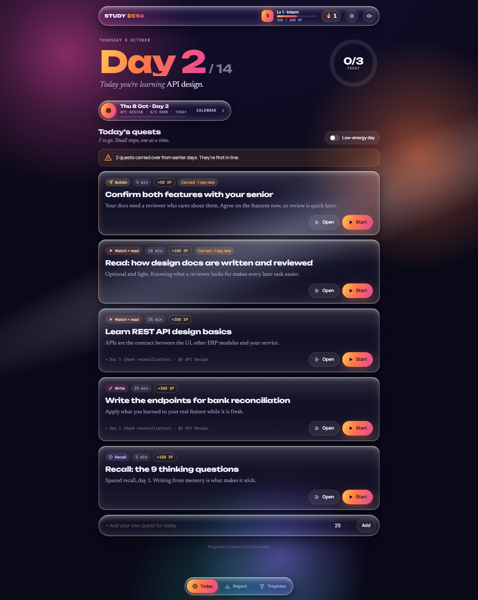
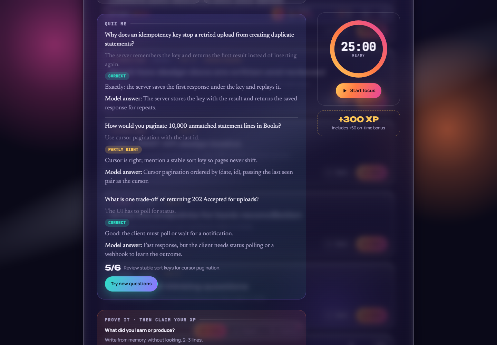
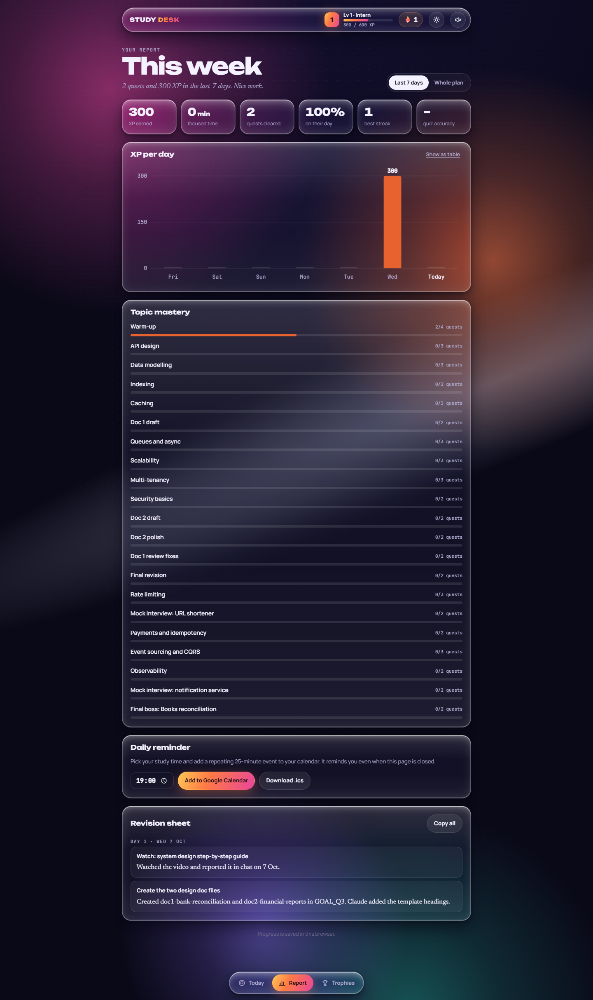
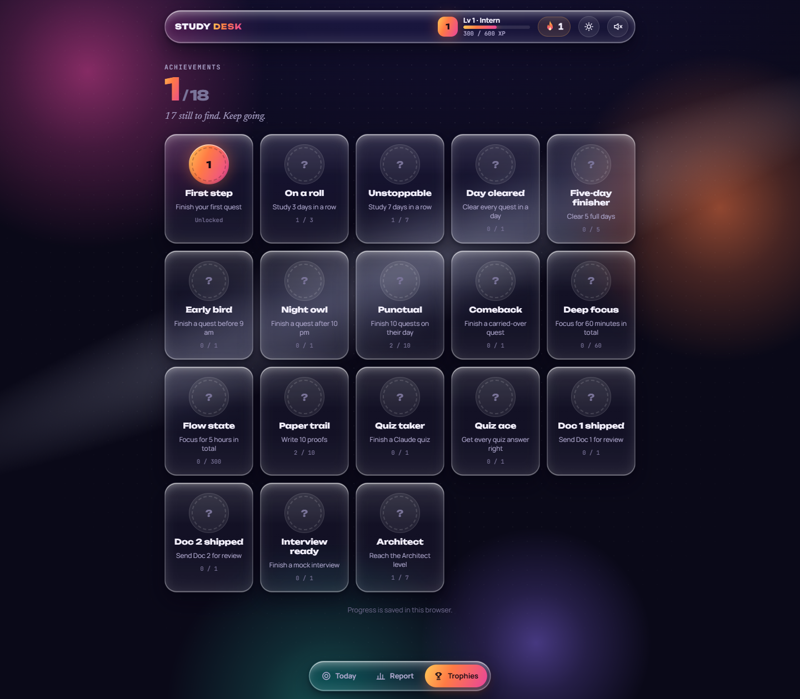
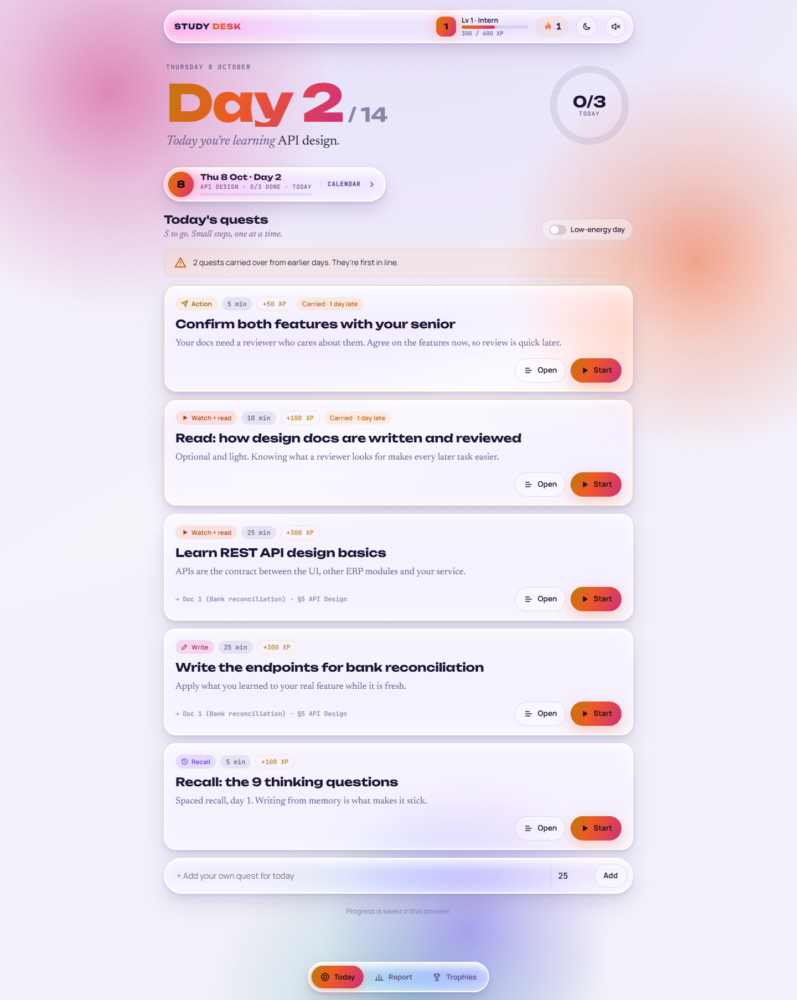
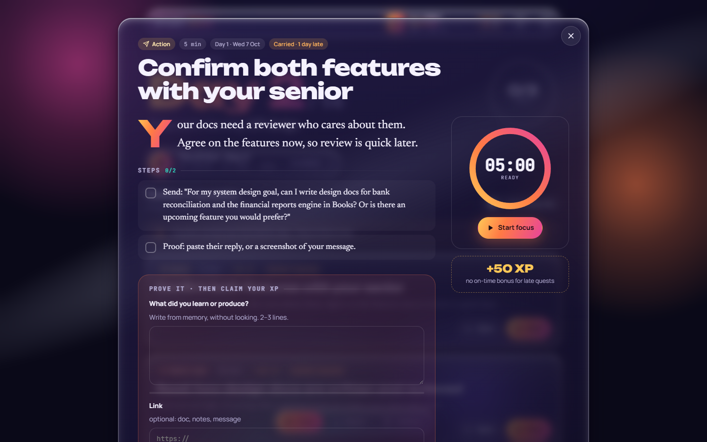
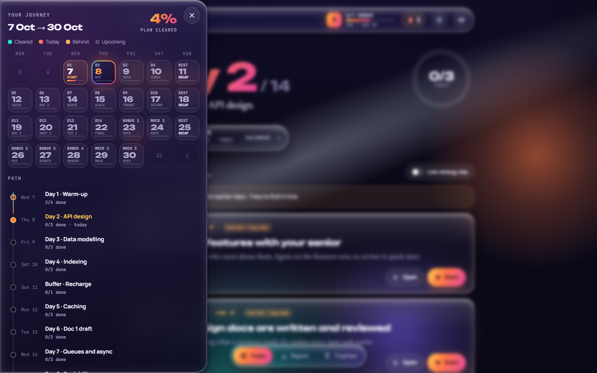
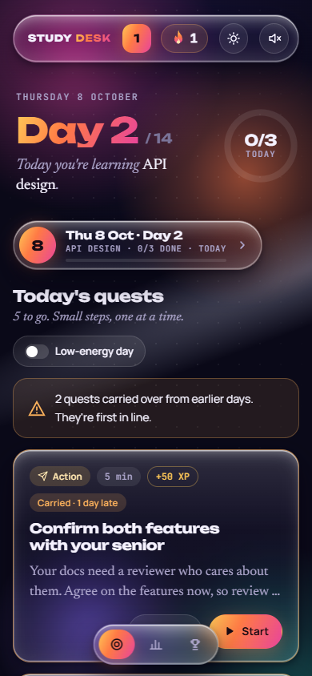

# Study Desk

A gamified study tracker for a two-week **system design** sprint. Every day hands you a few short quests with a focus timer, references and a diagram. You finish a quest by writing proof from memory. Unfinished quests carry over to the next day, and XP, levels and streaks keep you coming back.

Built for a learner who tires easily: 25-minute blocks, a one-tap **low-energy day**, and rewards that make finishing feel good.



| Quiz me (example answers) | Report | Trophies |
|---|---|---|
|  |  |  |

| Light theme | Quest reader | Calendar | Mobile |
|---|---|---|---|
|  |  |  |  |

## Features

- **Daily quests** with steps you can tick, curated references (with notes on what to read) and the design-doc section each quest feeds.
- **Animated diagram per topic**: API idempotency, data model, B-tree index, cache-aside, Kafka + DLQ, scaling, multi-tenancy, auth, plus both design-doc architectures.
- **Focus timer** (pause, resume, reset) with a floating mini timer and a chime when time is up.
- **Proof of completion**: a short written recall, plus an optional link or screenshot.
- **Carry-over**: anything unfinished moves to today, marked with how many days late.
- **XP, levels and streaks**: +50 XP on-time bonus, levels from Intern to Architect, confetti, a day-cleared screen and level-up effects.
- **Journey calendar** in a slide-out drawer; picking a day updates the whole header.
- **Low-energy mode** that shows just one quest.
- **Quiz me**: Claude writes three recall questions for a topic, grades your answers and explains what you missed (+10 XP per point). Runs in the claude.ai version.
- **18 achievement badges** with unlock animations and a trophy shelf.
- **Breaks and reminders**: a five-minute breathing break after a focus session, plus a repeating calendar reminder (Google Calendar link or `.ics`).
- **Report**: XP per day chart with tooltips and a table view, focus minutes, on-time rate, topic mastery, and every proof note collected as a revision sheet.
- **Typing and cursor effects**: headings and Claude's replies type themselves out; a soft cursor ring, glow and click ripple on desktop.
- **Liquid-glass UI** in dark and light themes (follows the system setting, toggle in the top bar).
- Responsive from 320px phones to desktop, in portrait and landscape; respects reduced motion.

## The plan it ships with

Fourteen study days from 7 to 22 October with two buffer days, covering API design, data modelling, indexing, caching, queues and async processing, scalability, multi-tenancy and security basics. An optional Week 3 (23–30 October) adds rate limiting, payments and idempotency, event sourcing and CQRS, observability, and three timed 45-minute mock interviews. The plan builds toward two reviewed design docs for an ERP accounting module:

1. **Bank Statement Import & Auto-Reconciliation**
2. **Financial Reports Engine** (trial balance, P&L, balance sheet and exports)

Tasks live in [`site/tasks.json`](site/tasks.json).

## Project structure

```
site/            Deployable static site (Vercel root)
  index.html     Built page (minified, tasks embedded)
  tasks.json     The study plan
  vercel.json    Cache headers
src/
  study-desk.html  Readable source: styles, markup and script
  build.js         Minifies the source, embeds tasks, writes site/
  week3.js         Generates the Week 3 quests and merges them into site/tasks.json
  package.json
docs/screenshots/
```

## Run it locally

No build step is needed to try it: open `site/index.html` in a browser. Progress is saved in that browser's local storage.

## Change the app or the plan

```bash
cd src
npm install        # once
npm run build      # rebuilds site/index.html (and src/build/ for the claude.ai version)
```

Edit `src/study-desk.html` for the UI, or `site/tasks.json` for the quests, then run the build again.

## Deploy to Vercel

- **CLI:** `cd site && npx vercel`
- **Git:** import this repo in Vercel and set **Root Directory** to `site`. No framework and no build command are needed.

## Performance

No framework and no runtime dependencies: one HTML file, about 50 KB gzipped (55 quests included). Fonts load without blocking the first paint. The background uses GPU-friendly gradients and pauses when hidden or covered. Measured on a simulated mid-range phone (6× CPU throttle, slow 3G): the quests appear in about 2 s and idle animation holds 120 fps.

## Tech

Vanilla HTML, CSS and JavaScript · inline SVG diagrams · Canvas confetti · Web Audio chimes · esbuild for minification · Google Fonts (Unbounded, Newsreader, Manrope, JetBrains Mono).

## Author

Tomesh Dhongade
